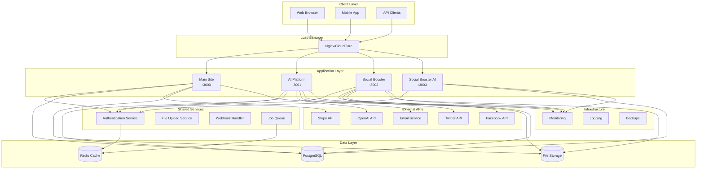
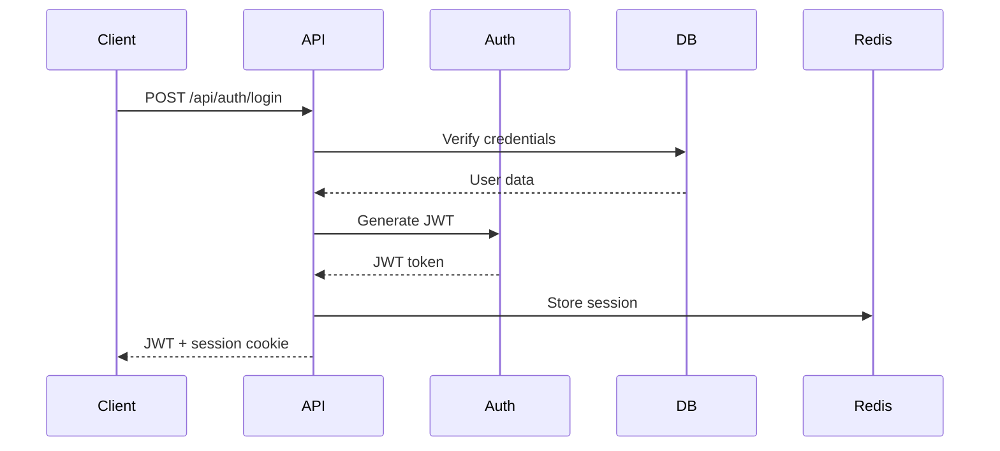
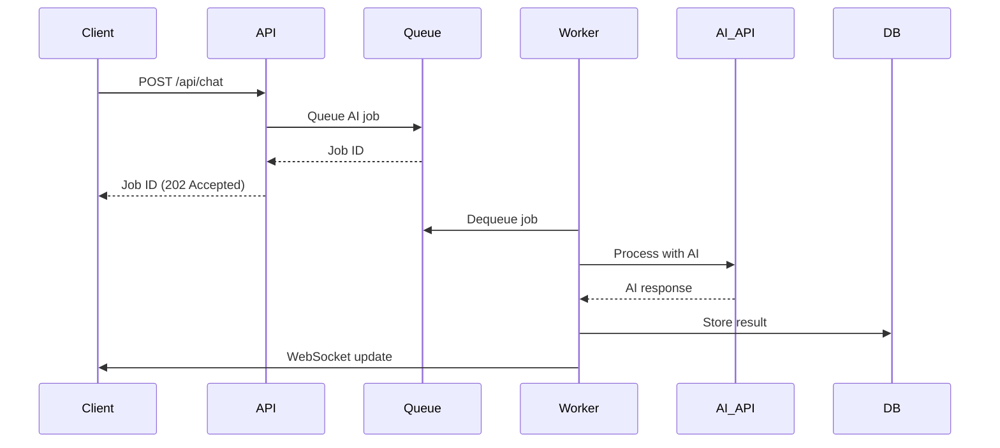
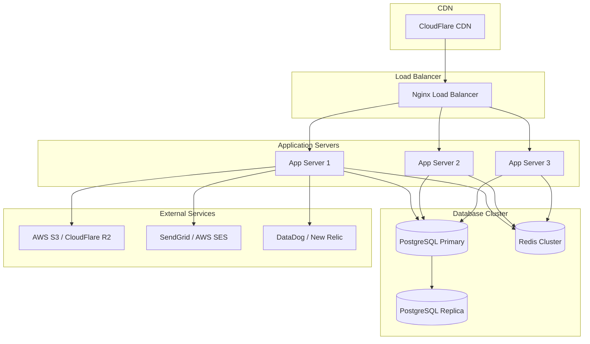
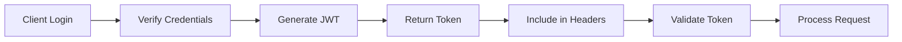

# Architecture Overview

SmartFlow Systems is designed as a modern, scalable microservices architecture that enables rapid development and deployment of business automation solutions.

## 🏗️ System Architecture



## 🎯 Design Principles

### 1. Microservices Architecture
- **Independent Deployment**: Each app can be deployed independently
- **Technology Diversity**: Different apps can use different tech stacks
- **Fault Isolation**: Failure in one service doesn't affect others
- **Scalable**: Services can scale independently based on demand

### 2. API-First Design
- **RESTful APIs**: Consistent API design across all services
- **GraphQL Support**: Where complex data relationships exist
- **OpenAPI Specs**: Documented and versioned APIs
- **Rate Limiting**: Built-in protection against abuse

### 3. Event-Driven Architecture
- **Asynchronous Processing**: Long-running tasks use job queues
- **Event Streaming**: Real-time updates using WebSockets
- **Webhook Integration**: External service notifications
- **Message Queues**: Reliable inter-service communication

### 4. Security by Design
- **Zero Trust**: All services authenticate requests
- **Encryption**: Data encrypted in transit and at rest
- **Secrets Management**: Centralized secret management
- **Audit Logging**: All actions logged for compliance

## 📱 Application Architecture

### Main Site (`apps/main-site`)
**Purpose**: Customer-facing website and business management

**Tech Stack**:
- **Runtime**: Node.js + Express
- **Database**: PostgreSQL (primary), Redis (sessions)
- **Frontend**: Server-side rendered HTML + Vanilla JS
- **Authentication**: JWT + Express sessions

**Key Features**:
- Landing pages and marketing content
- Customer lead management
- Payment processing integration
- Admin dashboard
- Contact forms and inquiries

**API Endpoints**:
```
GET  /                     # Homepage
GET  /pricing              # Pricing page
POST /api/leads            # Create lead
POST /api/contact          # Contact form
GET  /api/health           # Health check
POST /api/auth/login       # Authentication
```

### AI Platform (`apps/ai-platform`)
**Purpose**: Multi-agent AI orchestration and automation

**Tech Stack**:
- **Runtime**: Node.js + Express
- **Database**: PostgreSQL + Vector DB (Pinecone/Weaviate)
- **AI APIs**: OpenAI, Anthropic, Google PaLM
- **Queue**: Redis + Bull Queue
- **WebSockets**: Real-time AI interactions

**Key Features**:
- AI agent orchestration
- Conversational AI interfaces
- Workflow automation
- Knowledge base integration
- Real-time AI responses

**API Endpoints**:
```
POST /api/chat             # AI chat interface
POST /api/agents           # Create AI agent
GET  /api/agents/:id       # Get agent details
POST /api/workflows        # Workflow automation
POST /api/knowledge        # Knowledge base
WebSocket /ws/chat         # Real-time chat
```

### Social Booster (`apps/social-booster`)
**Purpose**: Social media automation and analytics

**Tech Stack**:
- **Runtime**: Node.js + React
- **Database**: PostgreSQL
- **APIs**: Twitter, Facebook, Instagram, LinkedIn
- **Scheduler**: Cron jobs + Redis
- **Analytics**: Custom analytics engine

**Key Features**:
- Social media post scheduling
- Multi-platform content management
- Analytics and reporting
- Audience engagement tracking
- Content calendar management

**API Endpoints**:
```
POST /api/posts            # Schedule social post
GET  /api/posts/:id        # Get post details
POST /api/analytics        # Analytics data
GET  /api/calendar         # Content calendar
POST /api/accounts         # Link social accounts
```

### Social Booster AI (`apps/social-booster-ai`)
**Purpose**: AI-enhanced social media content generation

**Tech Stack**:
- **Frontend**: Next.js + TypeScript + React
- **Backend**: Next.js API Routes
- **Database**: PostgreSQL (shared with Social Booster)
- **AI**: OpenAI GPT-4, DALL-E, Replicate
- **Deployment**: Vercel/Static hosting

**Key Features**:
- AI content generation
- Image generation for posts
- Content optimization suggestions
- A/B testing for content
- Performance analytics

**API Endpoints**:
```
POST /api/generate/text    # Generate post content
POST /api/generate/image   # Generate images
POST /api/optimize         # Content optimization
POST /api/ab-test          # A/B testing
GET  /api/analytics        # Performance data
```

## 🗄️ Data Architecture

### Database Design

#### PostgreSQL Schema
```sql
-- Shared across all applications
CREATE SCHEMA smartflow_shared;
CREATE SCHEMA smartflow_main;
CREATE SCHEMA smartflow_ai;
CREATE SCHEMA smartflow_social;

-- Main site tables
CREATE TABLE smartflow_main.users (
  id UUID PRIMARY KEY DEFAULT gen_random_uuid(),
  email VARCHAR(255) UNIQUE NOT NULL,
  created_at TIMESTAMP DEFAULT NOW()
);

CREATE TABLE smartflow_main.leads (
  id UUID PRIMARY KEY DEFAULT gen_random_uuid(),
  name VARCHAR(255) NOT NULL,
  email VARCHAR(255) NOT NULL,
  company VARCHAR(255),
  source VARCHAR(100),
  created_at TIMESTAMP DEFAULT NOW()
);

-- AI platform tables
CREATE TABLE smartflow_ai.agents (
  id UUID PRIMARY KEY DEFAULT gen_random_uuid(),
  name VARCHAR(255) NOT NULL,
  description TEXT,
  configuration JSONB,
  created_at TIMESTAMP DEFAULT NOW()
);

-- Social platform tables
CREATE TABLE smartflow_social.posts (
  id UUID PRIMARY KEY DEFAULT gen_random_uuid(),
  content TEXT NOT NULL,
  platforms TEXT[] NOT NULL,
  scheduled_at TIMESTAMP,
  published_at TIMESTAMP,
  created_at TIMESTAMP DEFAULT NOW()
);
```

#### Redis Data Structures
```bash
# User sessions
SET session:abc123 "{"userId":"uuid","expires":"2024-01-01T00:00:00Z"}"

# Job queues
LPUSH queue:ai-processing "{"type":"chat","payload":{...}}"
LPUSH queue:social-posting "{"type":"post","payload":{...}}"

# Cache
SET cache:user:uuid "{"name":"John","email":"john@example.com"}"
EXPIRE cache:user:uuid 3600

# Rate limiting
INCR rate:api:user:uuid
EXPIRE rate:api:user:uuid 3600
```

### Data Flow

#### User Authentication Flow


#### AI Processing Flow


## 🔧 Infrastructure Architecture

### Deployment Architecture

#### Production Environment


#### Development Environment
```bash
# Local development setup
docker-compose up -d postgres redis

# Start applications
npm run dev  # Starts all apps on different ports

# Service endpoints
Main Site:      http://localhost:3000
AI Platform:    http://localhost:3001
Social Booster: http://localhost:3002
Social AI:      http://localhost:3003
```

### Scaling Strategy

#### Horizontal Scaling
- **Load Balancer**: Nginx with round-robin
- **Application Servers**: Multiple instances behind load balancer
- **Database**: Read replicas for read-heavy operations
- **Cache**: Redis cluster for high availability

#### Vertical Scaling
- **CPU**: Scale up for compute-intensive AI operations
- **Memory**: Increase for data processing and caching
- **Storage**: SSD for database performance
- **Network**: High bandwidth for API responses

#### Auto-scaling Rules
```yaml
# Example Kubernetes HPA
apiVersion: autoscaling/v2
kind: HorizontalPodAutoscaler
metadata:
  name: smartflow-ai-platform
spec:
  scaleTargetRef:
    apiVersion: apps/v1
    kind: Deployment
    name: ai-platform
  minReplicas: 2
  maxReplicas: 10
  metrics:
  - type: Resource
    resource:
      name: cpu
      target:
        type: Utilization
        averageUtilization: 70
  - type: Resource
    resource:
      name: memory
      target:
        type: Utilization
        averageUtilization: 80
```

## 🔒 Security Architecture

### Authentication & Authorization

#### JWT Token Flow


#### Role-Based Access Control (RBAC)
```javascript
// User roles and permissions
const roles = {
  admin: ['read', 'write', 'delete', 'manage_users'],
  user: ['read', 'write_own'],
  viewer: ['read']
}

// Middleware for permission checking
function requirePermission(permission) {
  return (req, res, next) => {
    const userRoles = req.user.roles
    const hasPermission = userRoles.some(role => 
      roles[role].includes(permission)
    )
    
    if (!hasPermission) {
      return res.status(403).json({ error: 'Insufficient permissions' })
    }
    
    next()
  }
}
```

### Data Security

#### Encryption at Rest
- **Database**: PostgreSQL with TDE (Transparent Data Encryption)
- **Files**: AWS S3 with server-side encryption
- **Backups**: Encrypted backup files
- **Secrets**: Encrypted in vault storage

#### Encryption in Transit
- **HTTPS**: All HTTP traffic encrypted with TLS 1.3
- **Database**: SSL connections to database
- **API Calls**: All external API calls over HTTPS
- **WebSockets**: WSS (WebSocket Secure) connections

## 📊 Monitoring & Observability

### Metrics Collection
```javascript
// Application metrics
const metrics = {
  http_requests_total: new Counter({
    name: 'http_requests_total',
    help: 'Total number of HTTP requests',
    labelNames: ['method', 'route', 'status_code']
  }),
  
  ai_processing_duration: new Histogram({
    name: 'ai_processing_duration_seconds',
    help: 'Duration of AI processing operations',
    buckets: [0.1, 0.5, 1, 2, 5, 10, 30]
  }),
  
  database_query_duration: new Histogram({
    name: 'database_query_duration_seconds',
    help: 'Duration of database queries',
    labelNames: ['operation', 'table']
  })
}
```

### Health Checks
```javascript
// Comprehensive health check
app.get('/health', async (req, res) => {
  const checks = {
    timestamp: new Date().toISOString(),
    service: 'smartflow-ai-platform',
    version: process.env.APP_VERSION,
    status: 'healthy',
    checks: {
      database: await checkDatabase(),
      redis: await checkRedis(),
      external_apis: await checkExternalAPIs(),
      memory_usage: getMemoryUsage(),
      cpu_usage: getCpuUsage()
    }
  }
  
  const isHealthy = Object.values(checks.checks)
    .every(check => check.status === 'ok')
    
  res.status(isHealthy ? 200 : 503).json(checks)
})
```

## 🔮 Future Architecture Considerations

### Planned Enhancements

1. **Event Sourcing**: Implement event sourcing for audit trails
2. **CQRS**: Separate read and write models for better performance
3. **GraphQL Federation**: Unified API layer across all services
4. **Kubernetes**: Container orchestration for better scaling
5. **Service Mesh**: Istio for advanced traffic management
6. **Machine Learning Pipeline**: MLOps for AI model deployment

### Technology Roadmap

- **Q1 2024**: Kubernetes migration
- **Q2 2024**: GraphQL federation
- **Q3 2024**: Event sourcing implementation
- **Q4 2024**: Advanced AI pipeline

---

This architecture is designed to be **scalable**, **maintainable**, and **secure** while providing the flexibility needed for rapid business growth and feature development.